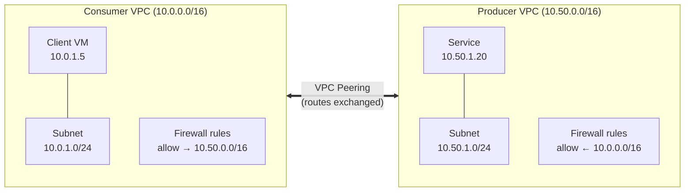
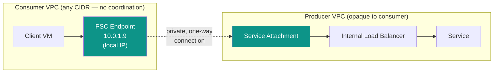

# Private Service Connect

### Connecting to private services in GCP — without the VPC plumbing

  GCP Networking · PSC Lab

<!--
Speaker note: We'll start with the problem — how do you reach a private service
today — walk through the traditional VPC-peering setup, then show how PSC turns
this into a service-oriented model.
-->

---
transition: fade-out
---

# The problem

You have a **service** running in one VPC. 
You have a **client** running in another VPC.

<v-clicks>

- Different teams. Different projects. Maybe different orgs.
- The service has **no public IP** — and shouldn't.
- The client just wants to call `https://service/...` privately.

</v-clicks>

So… how do you connect them?

<!--
The naive answer is "peer the VPCs". Let's see what that actually costs.
-->

---
layout: default
transition: slide-left
---

# Traditional setup: VPC Peering

The two VPCs are stitched together at the network layer.

Both networks now share routing scope. You're coupling **networks**, not consuming a **service**.

---
transition: slide-up
---

# Why this hurts

<v-clicks>

- 🔢 **IP coordination** — CIDR ranges must not overlap. Forever. Across every team you peer with.
- 🔗 **No transitive peering** — A↔B and B↔C does *not* give you A↔C. The mesh explodes.
- 🧱 **Firewall sprawl** — every consumer needs rules; every producer must allow each consumer range.
- 👀 **Over-exposure** — peering exposes the *whole* VPC's routes, not just the one service.
- ⛓️ **Tight coupling** — the consumer must know the producer's subnets, IPs, and topology.

</v-clicks>

You wanted to call **one service**. You bought into **someone else's entire network**.

---
layout: center
class: text-center
transition: slide-left
---

# What if you could just consume a *service*?

No peering. No shared CIDRs. No knowledge of the other VPC.

Private Service Connect

---
transition: slide-left
---

# PSC: service-oriented connectivity

The producer publishes a **Service Attachment**. The consumer creates an **Endpoint** — an IP *in its own VPC*.

The consumer talks to a **local IP**. GCP's fabric carries the traffic. The two VPCs never merge.

---
transition: slide-up
---

# What PSC abstracts away

### Gone ✅

<v-clicks>

- Shared / non-overlapping CIDR ranges
- VPC peering & route exchange
- Cross-VPC firewall coordination
- Knowing the producer's topology
- Transitive-peering workarounds

</v-clicks>

### What you deal with instead

<v-clicks>

- A **service attachment** (producer side)
- An **endpoint IP** in your own VPC
- Connection accept/reject by the producer
- That's basically it

</v-clicks>

The unit of connectivity is now a **service**, not a **network**.

---
layout: default
transition: fade
---

# Side by side

| | VPC Peering | Private Service Connect |
|---|---|---|
| **Unit of connection** | Whole network | A single service |
| **IP coordination** | Required (no overlap) | None — consumer uses its own IPs |
| **Routing scope exposed** | Entire peered VPC | Just the endpoint |
| **Transitive** | No (mesh explodes) | N/A — each endpoint is independent |
| **Firewall rules** | Per-consumer ranges | Local to the endpoint |
| **Coupling** | Tight (topology-aware) | Loose (service-oriented) |
| **Who initiates** | Symmetric | Consumer → producer, one-way |

---
layout: center
class: text-center
transition: slide-up
---

# Takeaways

<v-clicks>

🔌 PSC turns private connectivity into a <b>publish / consume</b> model.

🧭 No shared CIDRs, no peering mesh, no topology leakage.

🏷️ Producers expose a <b>service attachment</b>; consumers get a <b>local endpoint</b>.

Same goal — reach a private service — but coupled at the <b>service</b> layer, not the <b>network</b> layer.

</v-clicks>

---
layout: center
class: text-center
---

# Thanks

Let's build it in the lab →

  psc-lab

